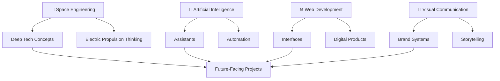

<div align="center">


<br/>

<a href="YOUR-LINKEDIN-LINK"></a> <a href="YOUR-WEBSITE-LINK"></a> <a href="mailto:YOUR-EMAIL"></a> 

</div>

---

## 🧭 Identity

I am a **Space Engineering student** and multidisciplinary builder focused on creating future-facing projects across **space technologies, artificial intelligence, web systems, visual communication, and entrepreneurship**.

I do not only build code. I build **systems, stories, interfaces, and experiences** that can move from idea to prototype — and from prototype to real-world impact.

```txt
SPACE ENGINEERING  ×  ARTIFICIAL INTELLIGENCE  ×  PRODUCT DESIGN
        ↓                       ↓                       ↓
   Deep Tech              Smart Systems           Memorable Interfaces
```

---

## 🚀 Mission Control

<table>
<tr>
<td width="50%">

### 🌌 What I Build

* AI-powered assistants and automation systems
* Modern web interfaces and digital platforms
* Space-tech concepts and propulsion-focused ideas
* Hackathon, innovation and community projects
* Brand systems, visual identities and campaign experiences

</td>
<td width="50%">

### 🎯 How I Think

* Prototype fast, improve constantly
* Make technology understandable
* Combine engineering with storytelling
* Design for trust, clarity and impact
* Build things that people remember

</td>
</tr>
</table>

---

## 🛠️ Tech Arsenal

<div align="center">


</div>

<br/>

<div align="center">


</div>

---

## 🌌 System Map

<div align="center">



</div>

---

## 🛰️ Featured Project Slots

> Replace `project-1`, `project-2`, `project-3`, and `project-4` with your real repository names.

<div align="center">

<a href="https://github.com/YOUR-USERNAME/project-1">
  
</a>
<a href="https://github.com/YOUR-USERNAME/project-2">
  
</a>
<a href="https://github.com/YOUR-USERNAME/project-3">
  
</a>
<a href="https://github.com/YOUR-USERNAME/project-4">
  
</a>

</div>

---

## 📡 Signal Dashboard

<div align="center">


<br/><br/>


<br/><br/>


</div>

---

## 🐍 Contribution Orbit

<div align="center">

<picture>
  <source media="(prefers-color-scheme: dark)" srcset="https://raw.githubusercontent.com/YOUR-USERNAME/YOUR-USERNAME/output/github-contribution-grid-snake-dark.svg" />
  <source media="(prefers-color-scheme: light)" srcset="https://raw.githubusercontent.com/YOUR-USERNAME/YOUR-USERNAME/output/github-contribution-grid-snake.svg" />
  
</picture>

</div>

---

## 🧠 Project Philosophy

<div align="center">

```txt
A strong project is not only functional.
It has technical depth, a clear story, visual identity, and a reason to exist.
```

</div>

---

## 🌐 Connect With Me

<div align="center">

<a href="YOUR-LINKEDIN-LINK"></a> <a href="YOUR-WEBSITE-LINK"></a> <a href="mailto:YOUR-EMAIL"></a>

</div>

---

<div align="center">


### ✨ The future is not something we wait for. We build it. ✨

</div>
